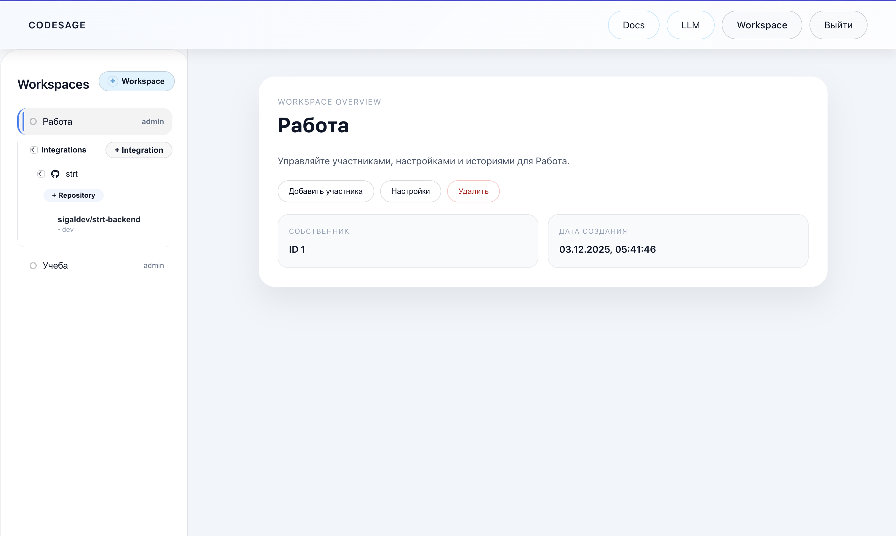

# CodeSage AI Reviewer Frontend

Frontend-приложение для управления AI Code Review: авторизация, workspace, Git-интеграции, подключение LLM и запуск ревью merge request.

## Содержание
- [1. Что внутри](#1-что-внутри)
- [2. Текущий пайплайн сборки и деплоя](#2-текущий-пайплайн-сборки-и-деплоя)
- [3. Требования](#3-требования)
- [4. Переменные окружения](#4-переменные-окружения)
- [5. Локальный запуск (Dev)](#5-локальный-запуск-dev)
- [6. Production-сборка без Docker](#6-production-сборка-без-docker)
- [7. Развертывание через Docker Compose](#7-развертывание-через-docker-compose)
- [8. Контракт frontend ↔ backend API](#8-контракт-frontend--backend-api)
- [9. Структура проекта](#9-структура-проекта)
- [10. Частые проблемы](#10-частые-проблемы)
- [11. Команды-шпаргалка](#11-команды-шпаргалка)

## 1. Что внутри
- `React 19` + `Vite 7`
- `react-router-dom` для маршрутизации
- `js-cookie` для хранения access/refresh токенов
- `fetch`-клиент с единым базовым URL (`VITE_API_BASE_URL`)
- Production-отдача статики через `nginx` (multi-stage Docker image)

Пример интерфейса:



## 2. Текущий пайплайн сборки и деплоя

Актуальный путь из кода репозитория:

1. Сборка frontend: `npm run build` (Vite).
2. Генерация статики в `dist/`.
3. В Docker-сценарии multi-stage образ:
   - stage `deps`: `npm ci`
   - stage `builder`: `npm run build`
   - stage `runner`: `nginx:alpine` + копирование `dist` в `/usr/share/nginx/html`
4. Контейнер поднимается через `docker-compose.yml` на порту `4173` (`4173 -> 80` внутри контейнера).

Важно: переменная `VITE_API_BASE_URL` в Vite вшивается на этапе сборки. Если меняете URL API, нужно пересобрать проект/образ.

## 3. Требования

- Node.js `20.19+` или `22.12+` (рекомендовано LTS 22)
- npm `10+`
- Docker + Docker Compose (если деплой в контейнер)

## 4. Переменные окружения

Создайте `.env` на основе `.env.example`.

| Переменная | Обязательна | Пример | Описание |
|---|---|---|---|
| `VITE_API_BASE_URL` | Да | `http://localhost:8000/api` | Базовый URL backend API |

Пример:

```bash
cp .env.example .env
```

`.env.example`:

```env
VITE_API_BASE_URL=http://localhost:8000/api
```

## 5. Локальный запуск (Dev)

1. Установите зависимости:

```bash
npm ci
```

2. Запустите dev-сервер:

```bash
npm run dev
```

3. Откройте адрес из вывода Vite (обычно `http://localhost:5173`).

## 6. Production-сборка без Docker

1. Убедитесь, что `.env` содержит правильный `VITE_API_BASE_URL`.
2. Соберите проект:

```bash
npm run build
```

3. Проверьте локально собранный `dist`:

```bash
npm run preview
```

## 7. Развертывание через Docker Compose

### 7.1 Быстрый запуск

```bash
docker compose up --build -d
```

Приложение будет доступно на `http://localhost:4173`.

### 7.2 Что делает Compose

- собирает образ из `Dockerfile`;
- поднимает сервис `frontend`;
- пробрасывает порт `4173:80`;
- подключает контейнер к bridge-сети `codesage`.

### 7.3 Обновление после изменений

```bash
docker compose down
docker compose up --build -d
```

### 7.4 Логи и диагностика

```bash
docker compose logs -f frontend
docker compose ps
```

## 8. Контракт frontend ↔ backend API

Frontend ожидает backend c префиксом, заданным в `VITE_API_BASE_URL`, и использует `credentials: include` + Bearer токен из cookie.

Основные endpoint’ы:

- Auth:
  - `POST /users/login/`
  - `POST /users/register/`
  - `POST /users/refresh/`
- LLM:
  - `GET /llm/integrations/list/`
  - `POST /llm/integrations/create/`
  - `PATCH /llm/integrations/{id}/update/`
  - `DELETE /llm/integrations/{id}/delete/`
- Workspace/Repository/MR:
  - `GET /workspace/list/`
  - `POST /workspace/create/`
  - `GET /workspace/{workspaceId}/repositories/{repositoryId}/merge-requests/list/`
  - `POST /workspace/{workspaceId}/merge-requests/{mergeRequestId}/reviews/run/`
  - и связанные endpoints для истории, rerun, cancel, publish.

Минимальные требования по CORS/CSRF на backend:

- разрешить origin фронтенда (`http://localhost:5173` для dev, `http://localhost:4173` для Docker);
- разрешить credentials;
- корректно обрабатывать `Authorization: Bearer ...`;
- добавить фронтенд-домены в trusted origins (если backend использует CSRF-проверки).

## 9. Структура проекта

```text
src/
  components/        # layout и UI-блоки
  context/           # auth context
  hooks/             # custom hooks
  pages/             # страницы приложения
  services/          # API-клиенты и запросы
docs/                # скриншоты документации в UI
Dockerfile           # multi-stage build + nginx runtime
docker-compose.yml   # локальный контейнерный запуск
nginx.conf           # SPA routing (try_files -> /index.html)
```

## 10. Частые проблемы

### `Vite requires Node.js version 20.19+`

Обновите Node.js до поддерживаемой версии (рекомендуется 22 LTS).

### После смены `VITE_API_BASE_URL` приложение ходит на старый URL

Это ожидаемо: переменная вшивается в build-артефакты. Пересоберите frontend:

```bash
npm run build
```

или пересоберите Docker-образ:

```bash
docker compose up --build -d
```

### Белый экран при обновлении страницы в production

Проверьте `nginx.conf`: должен быть SPA fallback (`try_files $uri $uri/ /index.html;`).

## 11. Команды-шпаргалка

```bash
# Установка зависимостей
npm ci

# Dev
npm run dev

# Lint
npm run lint

# Production build
npm run build

# Preview build
npm run preview

# Docker start
docker compose up --build -d

# Docker stop
docker compose down
```
